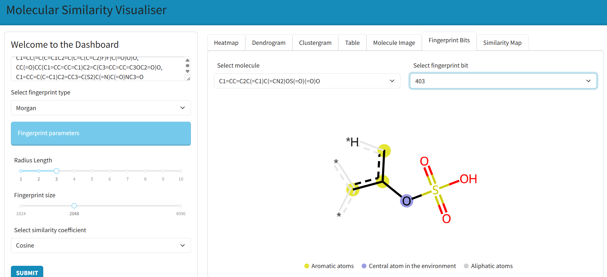

# ⌬ Molecular Similarity Visualiser

[](https://www.rdkit.org/)

Molecular Similarity and Structure Analysis are crucial components in the early stages of drug discovery. **Molecular Similarity Visualiser** is a web-based tool designed to make this process more accessible and intuitive for researchers and data scientists.

## 🚀 Overview

This application allows users to:
- Input a set of molecules using the SMILES (Simplified Molecular Input Line Entry System) format
- Generate molecular fingerprints using the **RDKit** library 
- Compute pairwise molecular similarity 
- Visualize similarity data interactively using **Plotly Dash**

## 🧰 Technologies Used

- [Plotly Dash](https://dash.plotly.com/) — framework used for building the web app
- [RDKit](https://www.rdkit.org/) — for fingerprint generation and similairity calculation  
- Python — the primary language used for application logic and computation

## 🖥️ Features

- Enter SMILES strings of molecules
- Interactive parameter adjustments 
- Choose fingerprint types (RDKit, Morgan, AtomPairs or MACCSKeys)
- Select similarity metrics (Tanimoto, Dice, Cosine, Russel, Sokal, McConnaughey, Kulczynski or Tversky)
- Visualize molecules and similarity data (Heatmap, Dendrogram, Clustergram, Fingerprint Bits, Similarity Map, Molecule Image)

## 📸 Screenshot




## 📦 Installation (Developed on Python 3.12.10)
1. Clone the repository:
   ```bash
   git clone https://github.com/your-username/molecular-similarity-visualiser.git
   cd molecular-similarity-visualiser

2. Install the required dependencies:
   ```bash
   pip install -r requirements.txt

3. Run the app:
   ```bash
   python main.py

4. Visit http://localhost:8050 in your browser.
